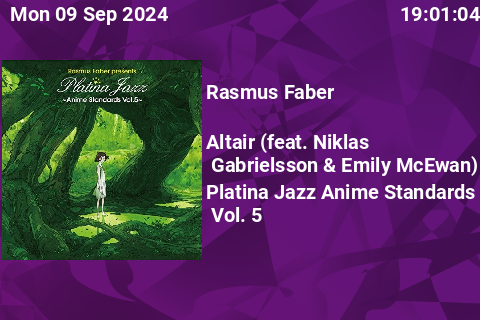

# turing-smart-screen-music-player-python
Shows the song that you have playing on gmusicbrowser on a turing smart screen

## Installation

This project requires [turing smart screen python](https://github.com/mathoudebine/turing-smart-screen-python) to function properly, first you will need to install it, you can see all the information on how to install it on that project github page.

You should run the configuration script at least once to configure your device as i use the normal configuration file.

In addition to the python requisites of turing smart screen python, you will also need to install the mutagen python module.

`python3 -m pip install mutagen` or `python.exe -m pip install mutagen`

After that copy the files from this proyect into the turing smart screen python folder. You will need to modify **musicplayerconfig.yaml** to point into the file you want to get the album info from. You can modify the provided **nowPlaying.sh** script to generate the file with gmusicbrowser's Now Playing plugin by adding `bash /path/to/script/nowPlaying.sh "%a;%t;%l;%c"` into said plugin.

You will need to generate the file yourself for use with other music players, the expected input is "artist name;track name;album name;path to image or file". Currently for the album image it supports getting it from an embed mp3 or flac or pointing it to a image file.

 

### Know limitations
I only tested it on a 3.5 display as i don't have any other one currently, if i can get my hands on a bigger one in the future i'll test it there and probably modify it so it adapts to the bigger display.

Currently it has to refresh the entire page when changing a song and it can't show some special characters (not sure where this last limitation comes from, i have to tinker with it more)
